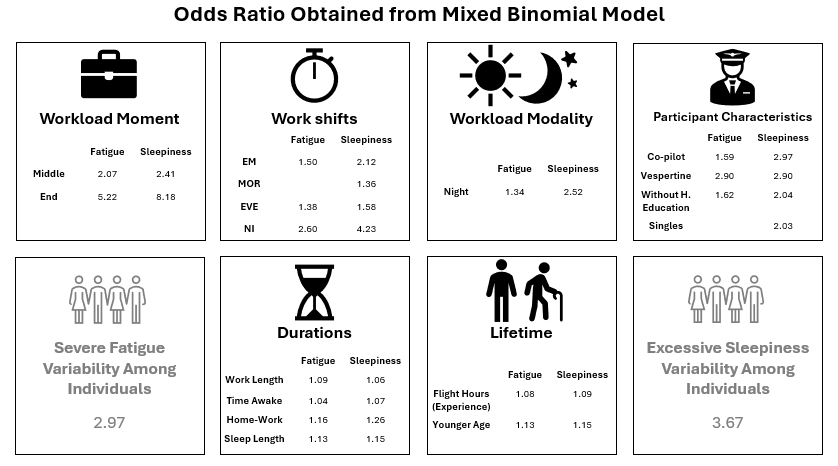

# Perception of Fatigue and Sleepiness linked to Irregular Workloads in Civil Aviation

       

This project analyzes data from 48 pilots under the revised "Lei do Aeronauta" (Law of the Airman) to assess the relationship between workload characteristics, pilot characteristics, and perceived fatigue & sleepiness. The project utilizes mixed binomial models and focuses on data collected using the Karolinska Sleepiness Scale and the Sam-Perelli Fatigue Scale.

This repository includes:

* Data: Raw data collected from pilot surveys, actimetry, and other sources (upon request).
* Code: Scripts for data cleaning, analysis, and visualization using relevant Python libraries.
* Analysis: Reports and documentation detailing the methodology, results, and conclusions.
* Jupyter Notebooks: Interactive python Markdown documents for exploring the data and results.

This project aims to contribute to the understanding of pilot fatigue and inform interventions and regulations to improve pilot well-being in civil aviation.

* Data preparation, feature extratction and data cleaning [feature_engineering.ipynb](feature_engineering.ipynb)
* Exploratory Data Analysis [EDA.ipynb](EDA.ipynb)
* Results related to perception of sleepiness [regression_sleepiness.ipynb](regression_sleepiness.ipynb)
* Results related to perception of fatigue [regression_fatigue.ipynb](regression_fatigue.ipynb)

---

## Brief Abstract

Over recent decades, growing concerns about labor-life quality and health have ignited extensive discussions within industry and legislative bodies. In the specific domain of civil aviation, workers life quality emerges as a pivotal factor intricately linked to the regularity and duration of pilot workloads. In Brazil, the Lei do Aeronauta (Law of the Airman), enacted in 1984, established regulations governing the maximum duration of workloads and mandated a minimum number of monthly days off for pilots. Recognizing the imperative to enhance the quality of life for commanders and co-pilots, this law underwent revision in 2017, notably increasing monthly days off, reducing permitted workload durations, and limiting consecutive workloads, including early-start and night routines. This study aims to quantify the impact of irregular workloads on pilot quality of life, focusing on perceived fatigue and sleepiness. Conducted longitudinally on 48 participants between the summer and spring of 2022, pilots reported their perceived sleepiness and fatigue using the Karolinska and Sam-Perelli scales, respectively. Measurements included actimetry, punch clock data, and specific participant metrics. Employing mixed binomial models, the study found that at the end of workloads, the odds for perceived excessive (severe) sleepiness (fatigue) were 718% (422%) higher than at the start. Specifically for night work shifts, the odds of perceived excessive (severe) sleepiness (fatigue) were 323% (160%) higher than in afternoon shifts. Factors such as participant chronotype vespertine, short sleep duration, long time awake before the workload, workloads comprising night periods (night modality), long times from home to work and long workload duration, enhanced the perception of excessive (severe) sleepiness (fatigue). Tailored interventions and potential regulatory adjustments are crucial for pilots well being and to avoid labour risks associated to sleepiness and fatigue.

---

## Main Results

---

## Model Description

The participants completed the KSS and SPS scales in response to their irregular work schedules, resulting in an imbalance in KSS and SPS measurements among the participants. Since the measurements were taken longitudinally at repeated times, there are two approaches to address this issue: utilizing a cluster-specific model or a population-averaged model. Given the assumption that each participant possesses unique characteristics and experiences or perceives sleepiness and fatigue differently, we opted for a cluster-specific model. This approach, with its advantages, enables us to estimate both cluster-specific effects and effects akin to population averages.

Bellow follows the applied model:

$$\ g(x_{ijk},\beta_{0ij},\beta_{1},\beta_s) = \beta_{0ij}+\beta_{1j}x_{1}+x_{ijk}^{T}\beta_s$$

$$\ \beta_{0ij} = \beta_0 + \alpha_i + \tau_j$$

$$\ \beta_{1j} = \beta_1 + \gamma_j$$

The first equation represents the level 1 of the chosen model. Both, the second and third equations represent the level 2 of the model representing the random intercept term and the random slope term resepctively. $\alpha_{i} \sim N(0,\sigma_{\alpha}^2)$ represents the random intercept due to participant cluster, $\tau_{j} \sim N(0,\sigma_{\tau}^2)$ represents the random intercept due to work-shifts or time the participant filled KSS and SPS scales and $\gamma_{j} \sim N(0,\sigma_{\gamma}^2)$, represents the random slope due to work-shifts, with $\tau_{j} \perp \gamma_{j}$. 
